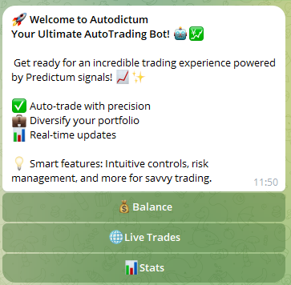
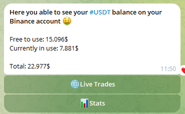
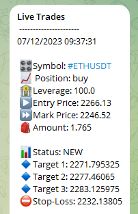
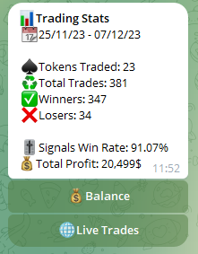

# 🚀 Telegram Automated Crypto Trading Bot

The AutoTrade Bot Project is a powerful bot designed to automate cryptocurrency 
trading based on signals from "Predictum" Telegram signals channel.

## 📈 Integration 

Connect the bot seamlessly to your Binance exchange account and enjoy automatic responses
to new crypto signal messages in your designated Telegram channel.

## 📊 Functionality 

Upon detecting a new signal, the bot intelligently analyzes the message, extracting vital details 
such as entry price, symbol name, order type (short or long), stop-loss price, and three take-profit levels.

## 🗃️ Data Management 

All trades are securely stored in a database file, providing a comprehensive overview of your trading activities. 
Monitor order statuses, including filled orders, take profit levels 1/2/3, and stop-loss positions.

## 💹 Real-time Insights 

Stay informed in real-time about open positions and receive alerts when a new trade commences. 
Track trade statistics, including win/loss counts, percentage gains, and dollar profits.

## 📉 Statistical Analysis 

Easily access and analyze trade statistics, calculating both percentage and dollar profits. 
The bot's intuitive interface allows you to assess your trading performance with precision.

## ⚙️ Live Trade Management 

Utilizing API and WebSocket technology, the bot efficiently manages trades in real-time. 
Experience seamless execution and precise control over your trading orders.

## 📬 Alerts and Notifications 

Receive timely alerts for new trades, ensuring you never miss an opportunity. 
Stay on top of your trading game with instant notifications.

## 🔗 Enhanced Features

- **Live Position Tracking:** Monitor open positions in real-time.
- **Dynamic Trades Management:** Respond to market changes with real-time price updates.
- **Comprehensive Trade History:** Access a detailed history of all trades, facilitating in-depth analysis.
- 
Take your crypto trading to the next level with the AutoTrade Bot – your reliable, automated trading companion! 🌐💼

## 🚀 How to Run 🚀

Follow these steps to set up and run the Shiling Script Project:

1. **Clone the Repository:**
   ```bash
   git clone https://github.com/adiel098/Telegram-AutoTrade-Bot.git
   cd Telegram-AutoTrade-Bot
   ```
2.  **Install Requirements:**
   ```bash
   # Assuming you have Python installed
   pip install -r requirements.txt
   ```
3.  **Configure Settings and API Keys::**

       Open the **config.yaml** file.
    
       Add your Binance API key and secret in the appropriate fields.
    
       Add your signals channel target.
5.  **Run the bot**
   ```bash
   # To run the bot and the real-time Websocket
   python main.py
   python web_socket_trades.py
   ```

## 📸 Screenshots

  


 
       

       

